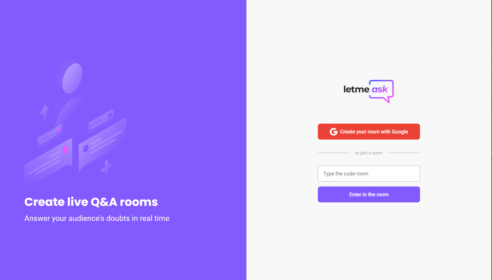
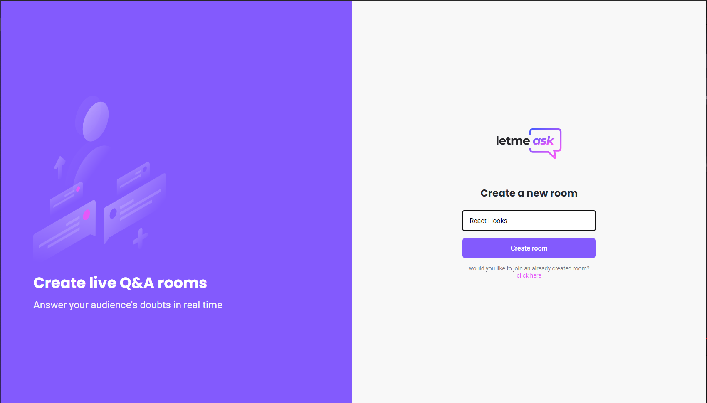
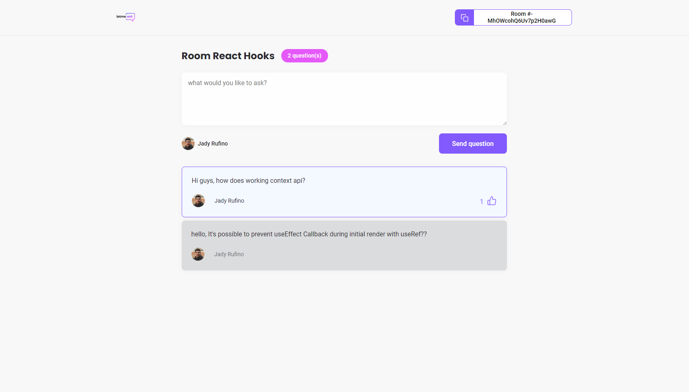
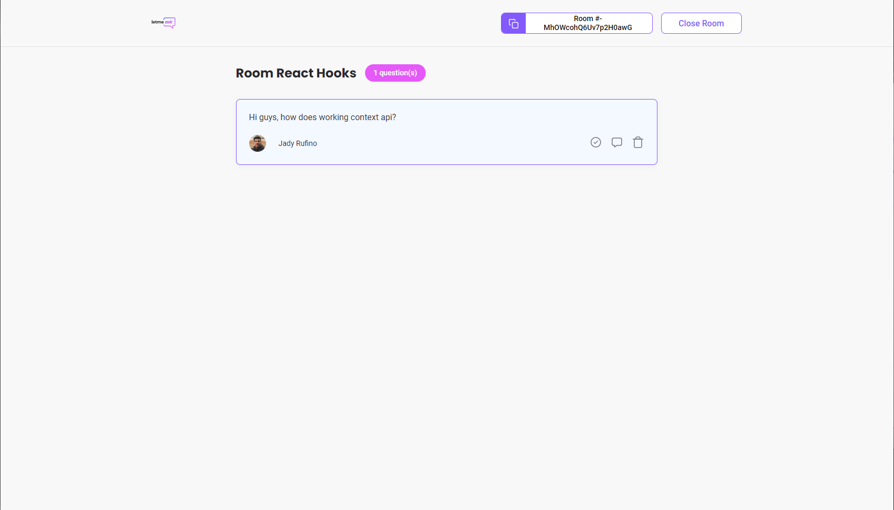

<p align="center">
  
</p>


<h1 align="center">
    
</h1>

<br>

## 📸 screenshot
<p align="center">
  
  
  
</p>


<!-- <p>
  
</p>

<p align="center">
  
</p> -->


## 🧪 Technologies


- [React](https://reactjs.org)
- [Firebase](https://firebase.google.com/)
- [TypeScript](https://www.typescriptlang.org/)

<br>

## 🚀 How to run


```zsh
# Instalar as dependências
$ yarn

# Iniciar o projeto
$ yarn start
```
The app will be available in your browse: http://localhost:3000.


## 💻 Project

Letmeask is perfect for content creators to create Q&A rooms with their audience in a very organized and democratic way

Este é um projeto desenvolvido durante a **[Next Level Week Together](https://nextlevelweek.com/)**, apresentada dos dias 20 a 27 de Junho de 2021.


## 🔖 Layout

You could view the project layout on the following link:

- [Layout Web](https://www.figma.com/file/u0BQK8rCf2KgzcukdRRCWh/Letmeask/duplicate) 


---

Feito com 💜 by Jady Rufino ✌